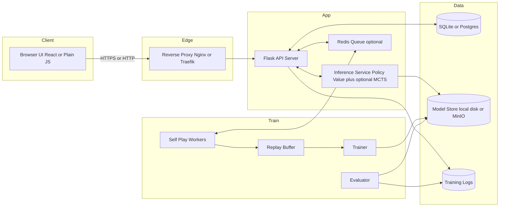
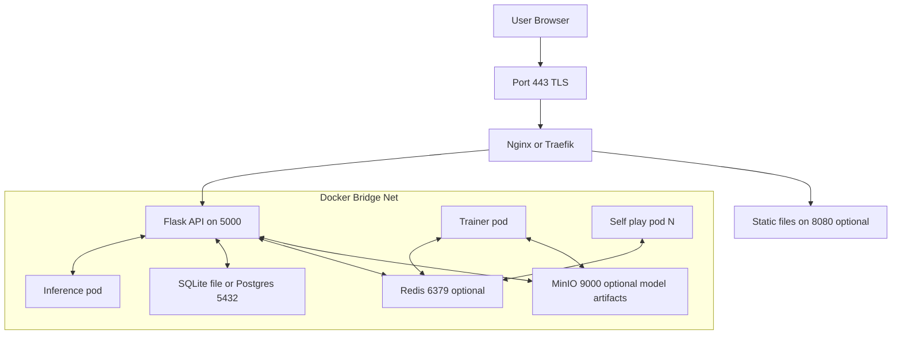
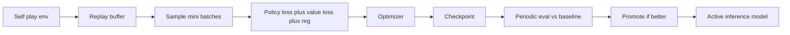
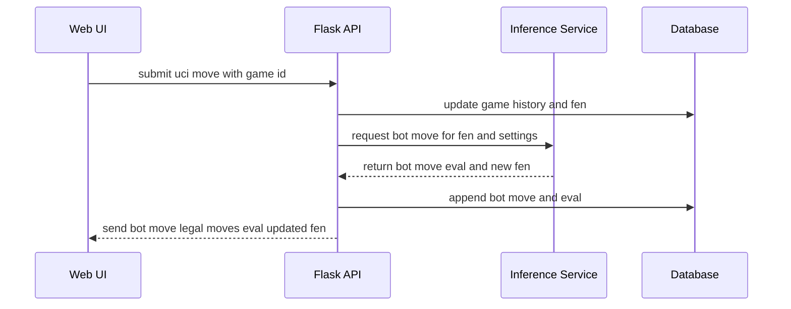

Awesome — here’s a compact, battle-ready PRD for your chessbot project with clear structure, clean Mermaid diagrams, and no parentheses anywhere to avoid parser issues.

# ChessBot PRD — Web RL Chess Engine

## 1. Summary

Build a web based chess app where a user plays against a home grown reinforcement learning engine. The web UI runs in the browser, the backend uses Python Flask, and the RL system trains via self play with an optional MCTS style search during inference. The system should be easy to run on macOS CPU or NVIDIA GPU and simple to deploy with Docker Compose.

## 2. Goals and Success Metrics

* Playable web chess vs bot with sub second UI latency on move submission
* RL training from scratch to reach stable strength roughly 1200 to 1600 rapid after N self play games
* Persist games, models, and training logs
* Clean modular architecture for future upgrades search pruning openings evaluation
* One command local deployment via Docker Compose

## 3. Scope

* Web UI board play clocks resign undo optional sound
* Backend Flask REST APIs move validation game state bot move model management
* RL pipeline self play replay buffer trainer evaluator checkpointing
* Storage options SQLite for MVP and Postgres optional
* Static assets and model artifacts storage local disk or MinIO optional
* Auth optional for MVP guest sessions ok

## 4. High Level Architecture

## 5. Deployment and Network Topology

Ports default

* 443 for TLS or 80 for dev
* Flask 5000 internal
* Postgres 5432 optional
* Redis 6379 optional
* MinIO 9000 optional

## 6. Core User Stories

* As a player I can start a new game choose side see legal moves and play against the bot
* As a player I can view move list captured pieces and evaluation number
* As a maintainer I can start stop continue training and monitor charts
* As a maintainer I can promote a checkpoint to production model and roll back

## 7. Frontend UX

* Board with drag drop and highlight legal moves
* Move list clock status bar new game button bot difficulty depth style
* Training dashboard simple charts ELO proxy loss value head accuracy game count
  Tech choice React plus chessboard library or light vanilla Canvas

## 8. API Contract MVP

Base path api v1

* POST game new
  body side white or black
  returns game id fen

* POST game move
  body game id uci
  returns fen legal moves eval bot move if any

* GET game state
  query game id
  returns fen history result status

* POST admin train start
  body steps self play workers

* POST admin train stop

* GET admin train status
  returns steps games per hour loss eval best checkpoint

* POST admin model activate
  body checkpoint id

* GET admin models
  returns list with id created size tag active

## 9. Data Model Sketch

Game

* id uuid
* start time end time
* pgn text
* result white black draw
* moves json array of uci and eval

Model

* id uuid
* path string
* created time
* tag text active bool

TrainingRun

* id uuid
* start end
* params json
* metrics json

## 10. RL System Design

### 10.1 State and Action

* State planes from board representation bitboards turn castling fifty move rule repetition optional
* Action 4672 move space style or dynamic legal move list indexing
* Rewards zero sum outcome win plus1 draw zero loss minus1 small shaping optional not required

### 10.2 Network

* Small ResNet style stack with policy head and value head
* Torch friendly input channels 8 to 18 depending on features
* Mixed precision optional

### 10.3 Training Loop

### 10.4 Self Play Workers

* Use python chess for move generation
* At each state run policy value
* Run MCTS optional for stronger play limit nodes or time
* Store s a pi z to buffer s state pi policy target z outcome

### 10.5 Evaluator

* Play N games current vs best
* If win rate above threshold promote

### 10.6 Inference Options

* Fast mode policy only with low depth pruning
* Strong mode policy plus MCTS limited simulations
* Deterministic at endgame temperature schedule optional

## 11. Inference Move Flow

## 12. Non Functional Requirements

* Latency under 300 ms for API round trip excluding heavy search
* Inference budget configurable max nodes or max time per move
* Training can resume from checkpoint after crash
* Logs shipped to files or console with JSON formatting
* Basic rate limit and CSRF for write endpoints
* CORS allow only configured origins

## 13. Tech Stack

* Frontend React Vite Tailwind or light vanilla alternative
* Backend Flask SQLAlchemy Pydantic style validation marshmallow ok
* RL PyTorch numpy python chess
* Queue Redis rq or Celery optional
* DB SQLite dev Postgres prod optional
* Storage local models folder MinIO optional
* Monitoring tensorboard for training and simple charts endpoint for UI

## 14. Dev Environment and Commands

* make up build run migrations seed
* docker compose services proxy api train inference redis db minio
* env files for secrets and ports

## 15. Rollout Plan

1 MVP play vs fixed depth policy only plus simple eval optional
2 RL loop offline self play single machine small model
3 Online inference upgrade to MCTS light
4 Dashboard for training metrics and model management
5 Persistence and auth
6 Optimization batching torchscript or onnx optional

## 16. Testing Strategy

* Unit tests move validator fen transitions api handlers
* Integration tests UI to API to inference happy paths
* Offline eval suite per opening set fixed rng
* Load test single user ten users burst

## 17. Risks and Mitigations

* Training instability use small nets gradient clipping lower lr strong data augmentation symmetry
* Inference slow use temperature zero in midgame limit sims pre sort legal moves
* Data growth rotate logs compress old games store only pgn and critical metrics

## 18. Acceptance Criteria

* User can complete a full game vs bot in browser
* Models can be trained and activated through simple admin calls
* Checkpoints saved and restored successfully
* Diagrams and docs live in repo docs folder

---

If you want, I can follow up with a ready to run repo scaffold including Docker Compose, Flask app skeleton, RL package layout, and the exact API stubs from this PRD.
