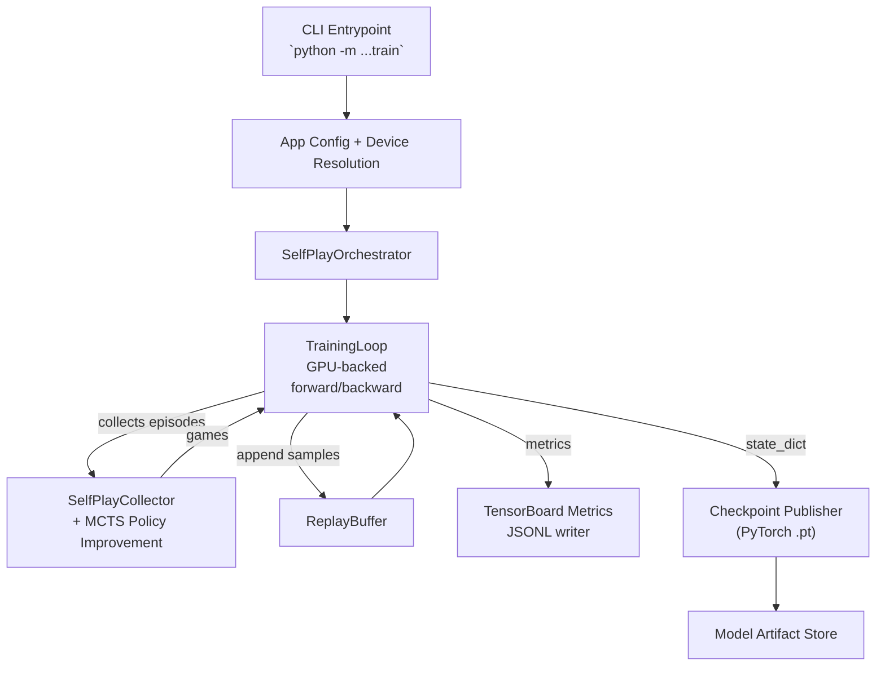
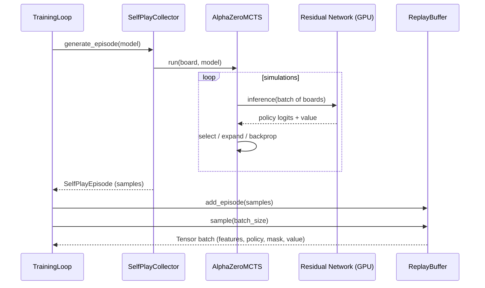
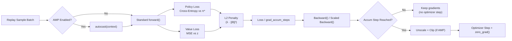
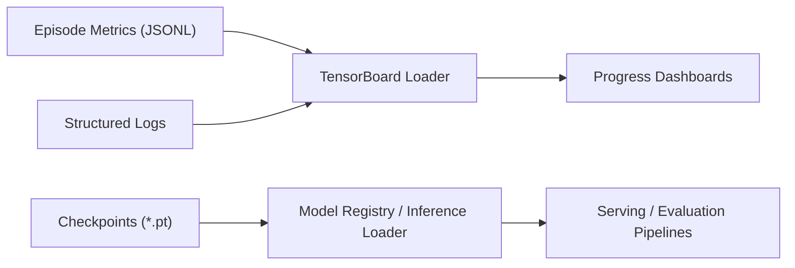

# ChessBrain Training Pipeline

This document captures the current self-play training pipeline, the major components involved, and the data/control flows between them. Use it to spot bottlenecks and reason about future improvements (e.g., parallel collectors, larger batches, tuned MCTS workloads).

## 1. End-to-End Flow

- **CLI Entrypoint** parses flags (`episodes`, `batch size`, `MCTS simulations`, AMP toggles, etc.) and wires device-specific behaviour (CUDA vs. MPS vs. CPU).
- **SelfPlayOrchestrator** owns job lifecycle, progress logging, and dispatching to the training loop.
- **TrainingLoop** performs gradient accumulation + optional mixed precision, drives replay sampling, and issues optimizer steps.
- **SelfPlayCollector** generates self-play episodes (batched inference, exploration, `AlphaZeroMCTS`) before handing samples back to the loop.
- **ReplayBuffer** stores normalized tensors ready for GPU consumption, enabling larger effective batches and re-use of past experience.
- **Metrics & Checkpointing** stream to TensorBoard-compatible files and versioned `.pt` artifacts.

## 2. Episode Generation Hot Path

- **Potential bottlenecks**: MCTS CPU loops (`select` + tree updates) and per-board inference. Batching more boards or parallelizing collectors increases GPU utilisation.
- **Future ideas**: Multiple collectors feeding the buffer, vectorized move selection, arena play for evaluation.

## 3. Training Step Anatomy

- **grad_accum_steps** allows micro-batches to be combined before stepping the optimizer—handy for GPUs like the 1080 Ti.
- **Mixed Precision (AMP)** reduces bandwidth usage and kernel latency; enable via `--no-amp` = false (default on CUDA).

## 4. Observability Artifacts

- Every run writes JSON lines (`metrics.jsonl`) under `TENSORBOARD_LOG_DIR/<job-id>/` for quick jq-based progress queries.
- Checkpoints are versioned by job + global step (`<job>_stepXXXX.pt`) and sent to model registration.

## 5. Current Bottlenecks & Opportunities

| Area | Observation | Potential Improvements |
|------|-------------|------------------------|
| MCTS CPU loop | GPU utilisation low when simulations dominate | Batch inference inside MCTS, parallel collectors, reduce simulations for early training |
| Replay sampling | Host→device copies every episode | Keep cache of batches on GPU, prefetch asynchronously |
| Logging | Per-episode prints useful but verbose | Adjustable logging cadence, structured logging to files only in prod |
| AMP/Batching | Disabled on non-CUDA | Extend to MPS (once upstream supports) or fall back to FP32 with larger accumulation |

Keeping this map in sync with the codebase makes it easier to reason about performance tweaks, future multi-GPU scaling, or distributed self-play expansion.

## 6. CLI Parameters (Defaults)

| Flag | Default | Description |
|------|---------|-------------|
| `--episodes` | `4` | Total self-play episodes to run for the job. Higher values improve training stability but increase wall-clock time. |
| `--batch-size` | `16` | Number of samples drawn from the replay buffer per optimizer step (before accumulation). Larger batches keep the GPU busier. |
| `--checkpoint-interval` | `2` | Frequency (in episodes) to emit a checkpoint + metrics snapshot. Lower intervals mean more disk writes. |
| `--exploration-rate` | `0.1` | ε value for epsilon-greedy mixing after MCTS to ensure diverse move selection. |
| `--seed` | `7` | Global seed for deterministic replay sampling and self-play initialization. Useful for reproducible profiling. |
| `--grad-accum-steps` | `1` | Number of micro-batches to accumulate before stepping the optimizer. Increases effective batch size without extra memory (especially on 1080 Ti). |
| `--micro-batch-size` | `None` | Optional cap on GPU micro-batch size; splits large batches into chunks to control memory use. |
| `--mcts-simulations` | `32` | Number of rollouts per move in `AlphaZeroMCTS`. Dominates CPU time; reduce for speed, raise for stronger policy targets. |
| `--mcts-cpuct` | `1.5` | Exploration constant balancing prior vs. value during MCTS selection. Tune alongside simulation count. |
| `--resume-checkpoint` | `None` | Path to an existing `.pt` checkpoint; loads weights, continues from the stored `global_step`, and runs additional episodes. |

> **Tip:** When running `scripts/demo/run_training_cycle.sh`, override these via environment variables (e.g., `EPISODES=200 GRAD_ACCUM_STEPS=4 ./scripts/demo/run_training_cycle.sh`). Use `NO_AMP=1` to disable AMP, and set `RESUME_CHECKPOINT=/path/to/model.pt` to continue from a saved state.
